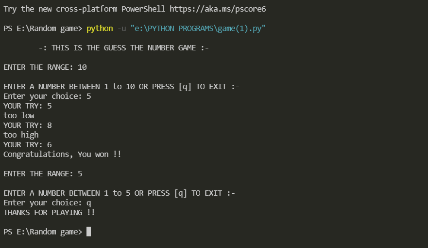

#  Random Number Game 🎮
 

## Discription 🗄️
Hyy there, this is a Guess the Number Game 🎮 😄 
Built in Python  
**Guess the Same Number as the Program Chooses 🎮**  

## Pre-requests 🖥️
- Have Python installed in Your PC .
- Or you can Try the Game in Online [Compiler.](https://onlinegdb.com/6gEyJhRA9)

## How to play 🎮 !
    
    1. At First You Have to select a Range.
    2. Then the Program will select a Number within the given Range. 
    3. You Have to match the Same Number.
    4. Enter a Number of Your choice.
    5. If Your Number :-
       1. Is lower   <Try again>
       2. Is Greater <Try again>
       3. Is Equal   <CongOo You won 🎉>
    6. If you Want to play Again Enter the Range. 
       or
       Press [q] To exit. 

___

## Example 🎮
 
 

